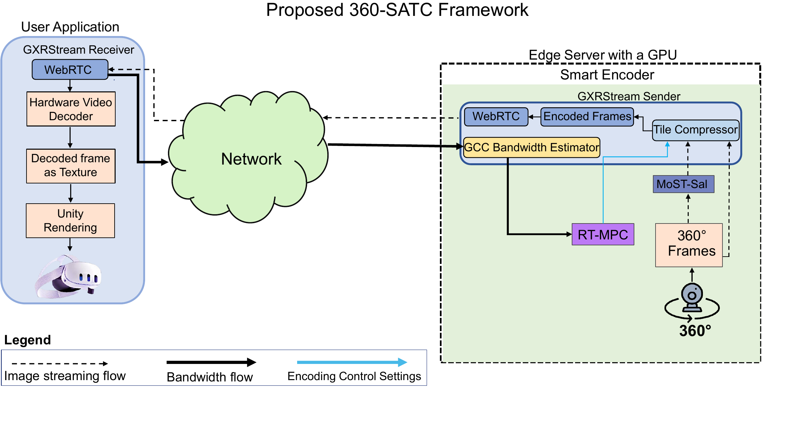

<div align="center">

# 360-SATC

### Saliency-Aware Tile Compression for Real-Time 360° Video Streaming at the Edge

[Quick start](#quick-start) · [Streaming guide](docs/streaming.md) · [Reproduce experiments](docs/reproduction.md) · [Download GXRStream](https://drive.google.com/file/d/1Jy8PrMn2373mifEb80dezbvN0fJgldyk/view?usp=sharing) · [Citation](#citation)

</div>

360-SATC uses **MoST-Sal** to identify important regions of a panoramic video,
**NVENC** to allocate spatial quality within one coded stream, and **GXRStream**
to deliver video to Unity and Meta Quest 3. **GCC + RT-MPC** controls the aggregate
bitrate in the retained network experiments. Spatial decisions require no viewer
head, gaze, or viewport feedback.

## Framework

[](docs/assets/360-satc-framework.pdf)

**Proposed streaming framework.** MoST-Sal guides spatial quality allocation at
an edge GPU, network feedback drives aggregate bitrate adaptation, and GXRStream
delivers the encoded panorama to a Unity receiver. Click the figure for the PDF.

## GXRStream in action


**Ubuntu sender and Unity receiver.** The illustrated session streams H.265 at
4096×2048 and 30 FPS on the RTX 4060 notebook. GXRStream's upstream release is
named QGXS/QSXR, so those names also appear in the interface.

Download the [GXRStream v0.1.0 bundle](https://drive.google.com/file/d/1Jy8PrMn2373mifEb80dezbvN0fJgldyk/view?usp=sharing)
for the Ubuntu sender, complete Unity receiver project, Quest 3 APK, and checksums.
Follow the [streaming guide](docs/streaming.md) to run it.

## Quick start

Ubuntu with an NVIDIA GPU is the primary encoding platform. The frozen MoST-Sal
model is included; videos and NVIDIA's Video Codec SDK are supplied separately.

```bash
git clone --depth 1 https://github.com/publioelon/360-SATC.git
cd 360-SATC
# Activate your working SATC Python environment first.
export SATC_SDK="/path/to/Video_Codec_SDK_13.0.19"
python satc.py doctor
```

New environment? Follow [setup](docs/setup.md). Already have a prepared 4096×2048,
60-FPS, BT.709 limited-range clip? Encode it directly:

```bash
python satc.py encode --video /path/to/prepared.mp4 --output outputs/satc
```

The default is H.264 at 12 Mbit/s, p7, 240 warm-up frames, and 896 measured frames.
The clip must contain at least 1,200 frames, including the retained end guard.
Results, encoded video, frame accounting, and logs are written under the output
folder. Use a new output folder for each run.

| Task | Command |
|---|---|
| Prepare your own clip | `python satc.py prepare --input source.mp4 --output data/prepared/demo.mp4 --frames 1800` |
| Uniform CBR comparison | `python satc.py encode --video prepared.mp4 --method cbr --output outputs/cbr` |
| H.265 or AV1 | Add `--codec hevc` or `--codec av1` |
| High bandwidth | Add `--bitrate 35` |
| Inspect all options | `python satc.py encode --help` |
| Headset delivery | [GXRStream quick start](docs/streaming.md) |
| Reproduce experiments | [Reproduction guide](docs/reproduction.md) |

## How it works

MoST-Sal predicts saliency from a 20-frame input. ERP-weighted tile scores are
smoothed over time, then ranked on a 5×9 grid. The final quality policy assigns
QP offsets **−2 to six tiles, −1 to six tiles, and 0 to the remaining 33**. These
logical regions become codec-aligned NVENC QP maps; they are not independently
encoded or transmitted tiles.

The retained runtime uses **BGR/255 inputs and temporal stride 8**. The manuscript
uses RGB terminology and describes consecutive frames. See
[implementation notes](docs/implementation.md) before interpreting a run as an
exact reproduction. `--history-stride 1` explicitly selects consecutive frames.

## Included components

| Folder | Contents |
|---|---|
| `saliency/` | Frozen MoST-Sal ONNX model and original evaluation recipes |
| `runtime/` | Readable NVENC bridge, live saliency inference, and final QP policy |
| `GXRStream/` | Ubuntu sender, encoded H.264 replay, and pinned receiver source |
| `experiments/` | Quality matrix, throughput, network, RTT, and viewport scripts |
| `configs/` | Example paths for experiment reproduction |
| `tests/` | Hardware-independent policy and block-map checks |

The earlier SST-Sal/JPEG, Unity Render Streaming, and WebApp implementation is
available in [the previous revision](https://github.com/publioelon/360-SATC/tree/6cb71b1b6288065c3a48c971ecfe94cb5c35ffde).

## Validation and license

GXRStream was extensively tested on the author's Ubuntu RTX 4060 notebook.
The [streaming guide](docs/streaming.md) links the existing release bundle with
the Unity project, Ubuntu sender, and Quest 3 APK.

This repository update passed hardware-independent syntax, model checksum,
policy, codec-map geometry, and retained integrity checks. The newly added
command wrappers and SATC replay integration were not rerun on GPU/Quest hardware
here; this update does not claim new experimental results.

360-SATC uses the [MIT license](LICENSE). Imported GXRStream/QGXS code retains
its [Apache 2.0 license](GXRStream/LICENSE). See [source provenance](docs/source_manifest.json).

## Citation

If you use 360-SATC in your research, please cite the accompanying manuscript:

```bibtex
@unpublished{silva2026satc,
  title  = {{360-SATC}: Saliency-Aware Tile Compression for Real-Time
            360 Degree Video Streaming at the Edge},
  author = {da Silva, Públio Elon Correa and Almeida, Jurandy and
            Verdi, Fábio Luciano and Caruso, Andrea and Grasso, Christian and
            Schembra, Giovanni and Patra, Gyanesh},
  year   = {2026},
  note   = {Research manuscript; accompanying source code},
  url    = {https://github.com/publioelon/360-SATC}
}
```

This entry describes the manuscript. Add the final publication details and DOI
when they become available.
