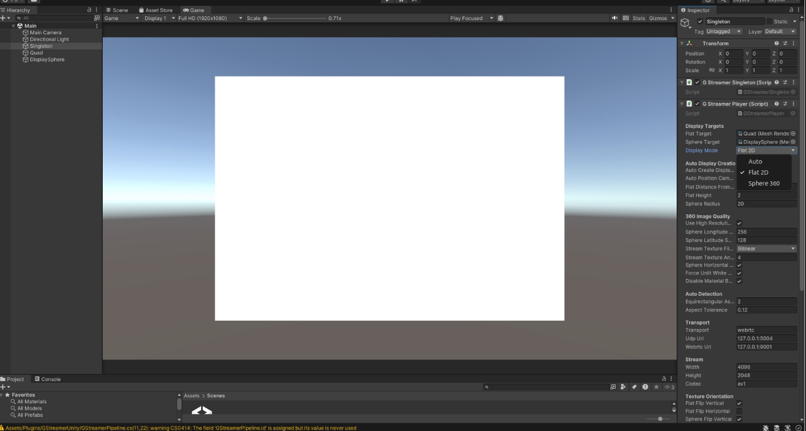
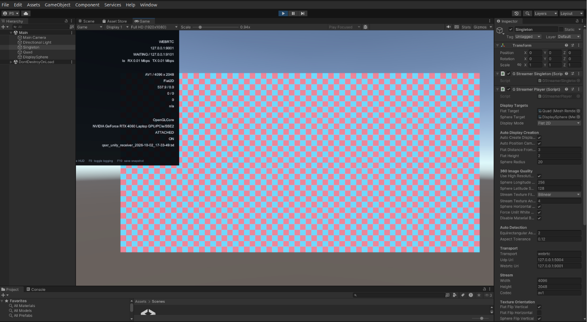

# GXRStream

The paper calls the transport **GXRStream**. Its upstream repository is currently
named **QGXS**. The Ubuntu sender recovered from the uploaded notebook is included
here. Unity and Quest receiver assets are pinned as `GXRStream/receiver-source`.

## Tested release: start here

GXRStream was extensively tested on the author's Ubuntu RTX 4060 notebook.
Download the existing [v0.1.0 release bundle from Google Drive](https://drive.google.com/file/d/1Jy8PrMn2373mifEb80dezbvN0fJgldyk/view?usp=sharing).
The upstream release documentation lists:

| File | Purpose |
|---|---|
| `QSXR-v0.1.0-Ubuntu-Sender-GUI.tar.gz` | Ubuntu sender GUI |
| `QSXR-v0.1.0-Ubuntu-Unity-Receiver.zip` | Complete Ubuntu Unity receiver project |
| `QSXR-v0.1.0-Quest3-Receiver.apk` | Installable Quest 3 receiver |
| `SHA256SUMS.txt` | Download integrity checks |
| `RELEASE_NOTES.md` | Release details |

Extract the sender and Unity archives. Open the receiver with Unity 2022.3 LTS
(the documented release uses 2022.3.45f1):

```bash
UNITY_EDITOR="$HOME/Unity/Hub/Editor/2022.3.45f1/Editor/Unity"
PROJECT="/path/to/QSXR-v0.1.0-Ubuntu-Unity-Receiver"
prime-run "$UNITY_EDITOR" -projectPath "$PROJECT" -force-glcore
```

Open `Assets/Scenes/Main.unity` and press Play. Start the sender:

```bash
cd /path/to/QSXR-v0.1.0-Ubuntu-Sender-GUI
python3 launcher_gui_linux.py
```

For receiver and sender on the same notebook, use `127.0.0.1`, signaling port
9001, and feedback port 9101. Receiver shortcuts: F8 for the HUD, F9 for logging,
and F10 for a snapshot.

For Quest 3, enable Developer Mode, connect the headset, and install the APK:

```bash
adb install -r QSXR-v0.1.0-Quest3-Receiver.apk
```

Open QGXS on the headset. Connect the sender and headset to the same network and
set the sender's destination to the headset IP, signaling port 9001.
Sender/receiver dimensions must match: 4096×2048 for the examples below.

The [upstream release README](https://github.com/publioelon/QGXS---quest-gstreamer-xr-streaming-#readme)
documents Ubuntu-to-Unity at 4096×2048/120 FPS and Ubuntu-to-Quest 3 at
4096×2048/60 FPS with H.264, H.265, and AV1. These are the existing release's
validation claims, not new measurements from this repository update.

## Optional receiver source build

```bash
git submodule update --init GXRStream/receiver-source
```

The complete source project is at
`GXRStream/receiver-source/receiver/unity/QSXRReceiver`. For rebuilding the Quest
receiver, follow `GXRStream/receiver-source/receiver/quest3/README.md`; it requires
Unity 2022.3 LTS, Android ARM64 tooling, and GStreamer Android libraries.

## Ubuntu sender

```bash
bash GXRStream/ubuntu/scripts/linux/install_sender_deps_ubuntu.sh
/usr/bin/python3 satc.py doctor --streaming-only
```

The distribution packages install the base GStreamer stack. NVIDIA `nvcodec`
plugins and `rtpgccbwe` may require your existing custom GStreamer build.
A stock Ubuntu install alone does not guarantee these elements are available.
Use a Python interpreter that can import `gi` and load your GStreamer installation.

Test delivery with a prepared video:

```bash
/usr/bin/python3 satc.py stream --video /path/to/prepared.mp4 --host QUEST_IP
```

This tests the regular GStreamer encoder/transport/receiver path. It does not
apply MoST-Sal or the SATC QP policy. H.264, H.265, and AV1 are available when the
corresponding sender plugins and receiver decoder are present.

## Send the SATC-encoded panorama

After `satc.py encode` completes, replay its H.264 output directly through the
retained external-bitstream FIFO path, without re-encoding:

```bash
/usr/bin/python3 GXRStream/stream_encoded.py \
  --input outputs/satc/runs/encode/encoded.h264 --host QUEST_IP
```

This preserves SATC's spatial quality allocation and tests headset delivery.
It is playback of a completed encode, not a measurement of live end-to-end
saliency inference or RT-MPC adaptation. The retained FIFO path accepts H.264
only; the regular streaming path supports the other codecs separately.

The original integrated network experiments are described in
[reproduction.md](reproduction.md). Their receiver is an instrumented GStreamer
client for transport measurements, distinct from Unity display performance.

The new `satc.py` and `stream_encoded.py` wrappers passed source checks here,
but have not been rerun on the notebook or headset. This does not change the
validation status of the existing GXRStream release.

## Interface reference

The screenshots below show setup states; a blank or checkerboard display before
frames arrive is not a successful playback result. Match the sender and receiver
codec and dimensions before starting the stream.

### Ubuntu sender


Select the input video, receiver address, codec, dimensions, frame rate, and
bitrate, then choose **Start sender**. The pictured values are UI examples.

### Unity display mode



In the receiver's **Singleton → G Streamer Player** component, choose **Flat 2D**
for a panorama preview or **Sphere 360** for spherical display.

### Receiver configuration and HUD



Check the WebRTC URI, stream dimensions, and codec in the Inspector. This
screenshot shows a waiting receiver; decoded frames and visible video confirm
playback, as illustrated below.


